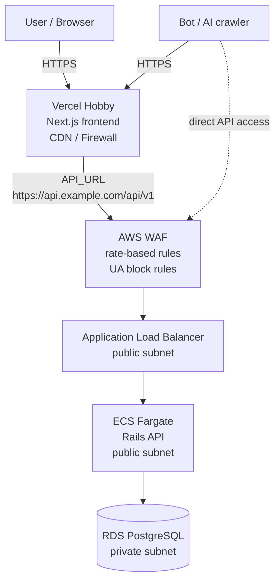
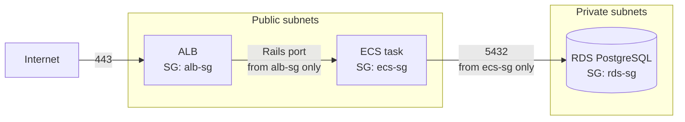
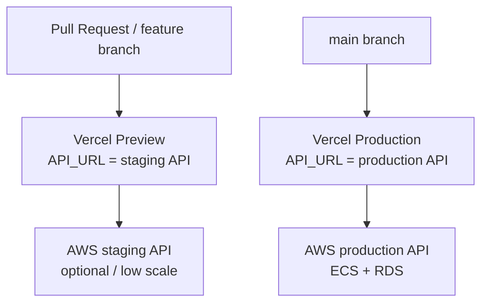
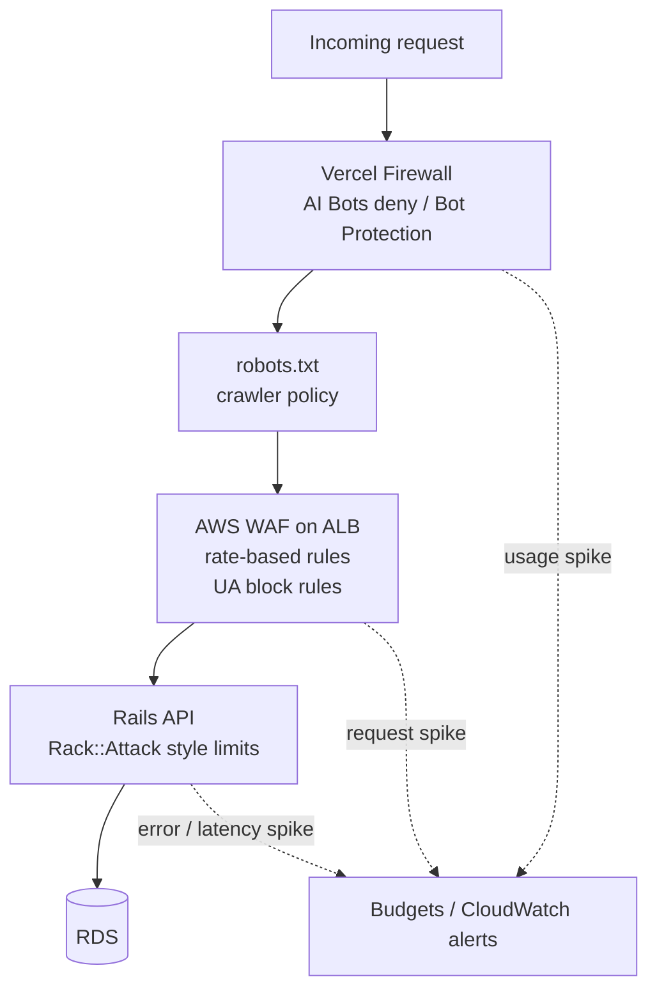
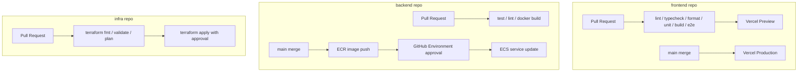

# WordBeetle デプロイ計画

## 概要

WordBeetle は転職活動用のポートフォリオとして公開するため、過剰な
本番商用構成ではなく、説明可能性・安全性・月額コストのバランスを優先する。

- フロントエンド: Vercel Hobby
- API: Rails API を AWS ECS Fargate で Docker 実行
- DB: Amazon RDS for PostgreSQL Single-AZ
- IaC: Terraform を分離した infra repository で管理
- NAT Gateway: 初期導入しない
- Bot 対策: Vercel Firewall、AWS WAF、Rails rate limit、予算アラートを併用

参考:

- [Vercel Pricing](https://vercel.com/pricing)
- [Vercel Environments](https://vercel.com/docs/deployments/environments)
- [Amazon ECS on AWS Fargate](https://docs.aws.amazon.com/AmazonECS/latest/developerguide/AWS_Fargate.html)
- [Amazon RDS for PostgreSQL](https://docs.aws.amazon.com/AmazonRDS/latest/UserGuide/CHAP_PostgreSQL.html)

## 全体構成

フロントエンドは Vercel に置き、Rails API は `api.<domain>` で公開する。
ECS は初期コストを抑えるため public subnet に置くが、Security Group で
ALB からの inbound のみ許可する。RDS は private subnet に置き、public
access は無効化する。

参考:

- [Vercel Git Deployments](https://vercel.com/docs/git)
- [Elastic Load Balancing](https://docs.aws.amazon.com/elasticloadbalancing/latest/application/introduction.html)
- [Security groups for your VPC](https://docs.aws.amazon.com/vpc/latest/userguide/vpc-security-groups.html)
- [Working with a DB instance in a VPC](https://docs.aws.amazon.com/AmazonRDS/latest/UserGuide/USER_VPC.WorkingWithRDSInstanceinaVPC.html)

## ネットワークと Security Group

Security Group の基本方針:

| 対象 | inbound                           | outbound             |
| ---- | --------------------------------- | -------------------- |
| ALB  | `443` from internet               | ECS task port        |
| ECS  | Rails API port from `alb-sg` only | RDS, HTTPS as needed |
| RDS  | `5432` from `ecs-sg` only         | default              |

この構成は ECS を完全な private subnet に置く構成より防御層は少ない。
ただし、ポートフォリオ用途では `ALB + Security Group + AWS WAF + Rails
rate limit` で十分に説明可能な安全性を確保する。商用化する場合は ECS を
private subnet に移し、NAT Gateway または VPC Endpoint を追加する。

参考:

- [Subnets for your VPC](https://docs.aws.amazon.com/vpc/latest/userguide/configure-subnets.html)
- [Control traffic to resources using security groups](https://docs.aws.amazon.com/vpc/latest/userguide/VPC_SecurityGroups.html)
- [Amazon ECS task networking](https://docs.aws.amazon.com/AmazonECS/latest/developerguide/task-networking.html)

## 環境戦略

初期は Vercel の Preview と Production を使い分ける。Preview は PR 確認用、
Production は `main` merge 後の本番公開用とする。

Vercel Hobby では Custom Environments に依存しない。固定の staging URL が
必要になった場合は、Vercel Pro または別 project の導入を検討する。

必要な Vercel 環境変数:

| 変数                 | Preview                 | Production                 |
| -------------------- | ----------------------- | -------------------------- |
| `API_URL`            | staging API URL         | production API URL         |
| `AUTH_SECRET`        | preview 用 secret       | production 用 secret       |
| `AUTH_GOOGLE_ID`     | preview 用 OAuth client | production 用 OAuth client |
| `AUTH_GOOGLE_SECRET` | preview 用 secret       | production 用 secret       |

Google OAuth は Preview/staging と Production で client を分ける。
NextAuth の callback URL は環境ごとに Google Cloud Console の Authorized
redirect URI に登録する。

参考:

- [Vercel Environment Variables](https://vercel.com/docs/environment-variables)
- [Vercel Deployments and Environments](https://vercel.com/docs/deployments/environments)
- [Google OAuth 2.0 for Web Server Applications](https://developers.google.com/identity/protocols/oauth2/web-server)
- [NextAuth.js Environment Variables](https://authjs.dev/getting-started/deployment)

## NAT Gateway を使わない判断

NAT Gateway は private subnet 内の ECS task などが、外部インターネットへ
出ていくための管理型出口である。ECS を private subnet に置いたまま外向き
通信を許可できる一方、東京リージョンでは低トラフィックでも固定費が大きい。

初期構成では NAT Gateway を使わない理由:

- ポートフォリオ用途で、固定費を抑える優先度が高い
- ECS は ALB からの inbound のみに制限できる
- RDS は private subnet に置ける
- 外向き通信要件が増えた段階で追加判断できる

将来 NAT Gateway または VPC Endpoint を検討する条件:

- ECS task を private subnet に移したい
- Rails API が外部 API へ安定して通信する必要がある
- ECR、CloudWatch Logs、Secrets Manager などへの private 接続を整理したい
- 商用運用として network boundary を強化したい

参考:

- [NAT gateways](https://docs.aws.amazon.com/vpc/latest/userguide/vpc-nat-gateway.html)
- [Pricing for NAT gateways](https://docs.aws.amazon.com/vpc/latest/userguide/nat-gateway-pricing.html)
- [Amazon VPC pricing](https://aws.amazon.com/vpc/pricing/)
- [AWS PrivateLink pricing](https://aws.amazon.com/privatelink/pricing/)

## 月額コスト見積もり

前提:

- Region: `ap-northeast-1`
- Vercel: Hobby
- ECS: Fargate 1 task, 小さめの CPU/memory
- RDS: PostgreSQL Single-AZ, micro/small + 少量 storage
- NAT Gateway: なし
- トラフィック: ほぼ無風

| 項目                                                    | 月額目安      |
| ------------------------------------------------------- | ------------- |
| Vercel Hobby                                            | `$0`          |
| ECS Fargate Rails API                                   | `$8-15`       |
| Application Load Balancer                               | `$20-25`      |
| RDS PostgreSQL Single-AZ                                | `$18-35`      |
| AWS WAF basic rules                                     | `$8-15`       |
| Route 53 hosted zone                                    | about `$0.50` |
| CloudWatch Logs / Secrets Manager / ECR / data transfer | `$3-10`       |
| NAT Gateway                                             | `$0`          |

通常時の合計目安は **月 `$60-100`** とする。

NAT Gateway を追加すると、東京リージョンでは固定費だけで概ね
**月 `$45-55`** 増える。ポートフォリオ初期公開では採用しない。

コスト事故対策として AWS Budgets を設定する。

- `$30`: 早期警戒
- `$50`: 想定レンジ接近
- `$80`: 調査必須
- `$100`: 緊急対応

参考:

- [AWS Fargate pricing](https://aws.amazon.com/fargate/pricing/)
- [Elastic Load Balancing pricing](https://aws.amazon.com/elasticloadbalancing/pricing/)
- [Amazon RDS for PostgreSQL pricing](https://aws.amazon.com/rds/postgresql/pricing/)
- [AWS WAF pricing](https://aws.amazon.com/waf/pricing/)
- [AWS Budgets](https://docs.aws.amazon.com/cost-management/latest/userguide/budgets-managing-costs.html)

## AI crawler と bot 対策

AI crawler は `robots.txt` を守るとは限らず、API domain を直接叩く可能性も
ある。そのため、Vercel だけに依存せず AWS WAF と Rails 側でも制限する。

対策方針:

- Vercel Firewall
  - AI Bots Managed Ruleset を使える場合は Deny にする
  - Bot Protection は Log で確認後、問題なければ Challenge にする
  - Hobby の custom rule 数制限を意識し、細かい条件は AWS/Rails 側で補う
- `robots.txt`
  - AI training crawler には `Disallow: /` を明示する
  - Googlebot/Bingbot など検索向け crawler は必要に応じて許可する
  - 任意遵守なので、セキュリティ境界とはみなさない
- AWS WAF
  - ALB に Web ACL を付ける
  - 同一 IP の短時間大量 request を rate-based rule で block
  - AI crawler の User-Agent block rule を追加する
  - AWS Managed Rules Common Rule Set を最小構成で追加する
  - Bot Control は初期導入しない。必要時に Common Bot Control のみ検討する
- Rails API
  - IP、user、token 単位の rate limit を入れる
  - `/auth/guest`、`/auth/google`、作成/更新/削除系 endpoint を厳しめにする
  - 未認証 request は低い閾値で制限する
- 監視
  - ALB request count、WAF blocked count、ECS CPU/memory、RDS connections を監視
  - 異常時は Vercel Attack Challenge Mode または AWS WAF の緊急 block rule を使う

この構成で止めやすいもの:

| 種類               | 対応                                           |
| ------------------ | ---------------------------------------------- |
| 既知の AI crawler  | Vercel AI Bots / AWS WAF UA block / robots.txt |
| 短時間大量アクセス | AWS WAF rate-based rule / Rails rate limit     |
| API 直叩き         | AWS WAF on ALB                                 |
| User-Agent 偽装    | rate limit と認証必須化で被害を抑える          |

完全な高額請求防止はできない。WAF で block しても WAF request 課金は発生する。
ただし ECS、Rails、RDS まで到達させないことで、より高い処理コストと障害を
抑えられる。

参考:

- [Vercel WAF](https://vercel.com/docs/vercel-firewall/vercel-waf)
- [Vercel WAF Managed Rulesets](https://vercel.com/docs/vercel-firewall/vercel-waf/managed-rulesets)
- [Vercel DDoS Mitigation](https://vercel.com/docs/vercel-firewall/ddos-mitigation)
- [AWS WAF rate-based rules](https://docs.aws.amazon.com/waf/latest/developerguide/waf-rule-statement-type-rate-based.html)
- [AWS WAF pricing](https://aws.amazon.com/waf/pricing/)

## CI/CD

Frontend repo:

- PR で `pnpm lint`、`pnpm typecheck`、`pnpm format:check`、
  `pnpm test:unit`、`pnpm build`、`pnpm test:e2e` を実行する
- Vercel GitHub integration で Preview / Production deploy を行う
- `main` を production branch とする

Backend repo:

- PR で test、lint、Docker build を確認する
- `main` merge 後に Docker image を ECR に push する
- ECS production deploy は GitHub Environments の approval 後に実行する

Infra repo:

- Terraform は AWS リソースのみ管理する
- PR で `terraform fmt -check`、`terraform validate`、`terraform plan`
- `main` merge 後の `terraform apply` は approval を必須にする
- AWS 認証は GitHub OIDC を使い、長期 access key は使わない

参考:

- [GitHub Actions](https://docs.github.com/actions)
- [Using environments for deployment](https://docs.github.com/actions/deployment/targeting-different-environments/using-environments-for-deployment)
- [aws-actions/configure-aws-credentials](https://github.com/aws-actions/configure-aws-credentials)
- [Deploying Git repositories with Vercel](https://vercel.com/docs/git)

## Terraform 管理方針

Terraform は frontend repo ではなく、分離した infra repo で管理する。
frontend repo と backend repo は application code と CI を持ち、infra repo は
AWS リソースと Terraform state を管理する。

管理対象:

- VPC, subnets, route tables
- Security Groups
- ALB, target group, HTTPS listener
- AWS WAF Web ACL
- ECR repository
- ECS cluster, task definition, service
- RDS PostgreSQL, subnet group, parameter group
- Secrets Manager または SSM Parameter Store
- IAM role for GitHub OIDC
- S3 backend and DynamoDB lock table
- Route 53 records

Vercel は初期段階では Terraform 管理しない。Vercel project、environment
variables、domain は Vercel Dashboard または CLI で管理し、運用が固まった
段階で Terraform provider の導入を検討する。

参考:

- [Terraform AWS Provider](https://registry.terraform.io/providers/hashicorp/aws/latest/docs)
- [Terraform S3 backend](https://developer.hashicorp.com/terraform/language/backend/s3)
- [AWS Secrets Manager](https://docs.aws.amazon.com/secretsmanager/latest/userguide/intro.html)
- [Systems Manager Parameter Store](https://docs.aws.amazon.com/systems-manager/latest/userguide/systems-manager-parameter-store.html)
- [Amazon Route 53](https://docs.aws.amazon.com/Route53/latest/DeveloperGuide/Welcome.html)

## 将来の改善候補

- ECS を private subnet に移し、NAT Gateway または VPC Endpoint を追加する
- RDS を Multi-AZ に変更する
- AWS WAF Bot Control Common を追加する
- CloudFront を API の前段に置く
- Vercel Pro へ移行し、Custom Environment やより多い Firewall rule を使う
- 監視を Datadog、Sentry、OpenTelemetry などへ拡張する

参考:

- [Amazon RDS Multi-AZ deployments](https://docs.aws.amazon.com/AmazonRDS/latest/UserGuide/Concepts.MultiAZ.html)
- [AWS WAF Bot Control](https://docs.aws.amazon.com/waf/latest/developerguide/aws-managed-rule-groups-bot.html)
- [Amazon CloudFront](https://docs.aws.amazon.com/AmazonCloudFront/latest/DeveloperGuide/Introduction.html)
- [OpenTelemetry on AWS](https://aws-otel.github.io/docs/introduction)
